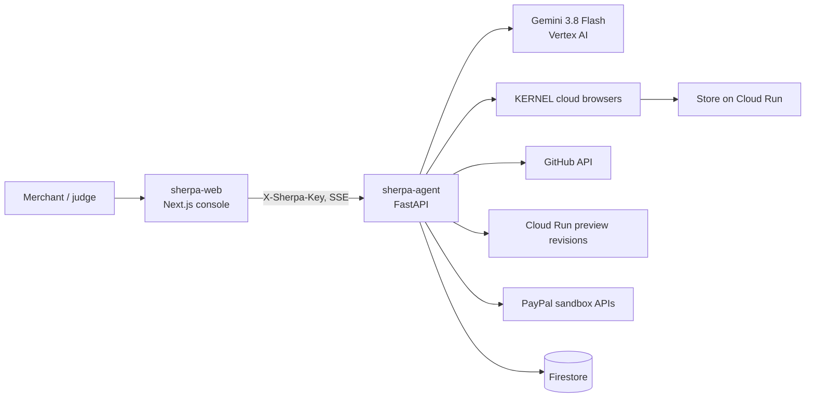

# Architecture

```mermaid
flowchart LR
  user[Merchant / judge] --> web[sherpa-web<br/>Next.js console]
  web -- X-Sherpa-Key, SSE --> agent[sherpa-agent<br/>FastAPI]
  agent --> gemini[Gemini 3.8 Flash<br/>Vertex AI]
  agent --> kernel[KERNEL cloud browsers]
  kernel --> store[Store on Cloud Run]
  agent --> gh[GitHub API]
  agent --> run[Cloud Run preview revisions]
  agent --> paypal[PayPal sandbox APIs]
  agent --> fs[(Firestore)]
```

Details are filled in as each phase lands.
